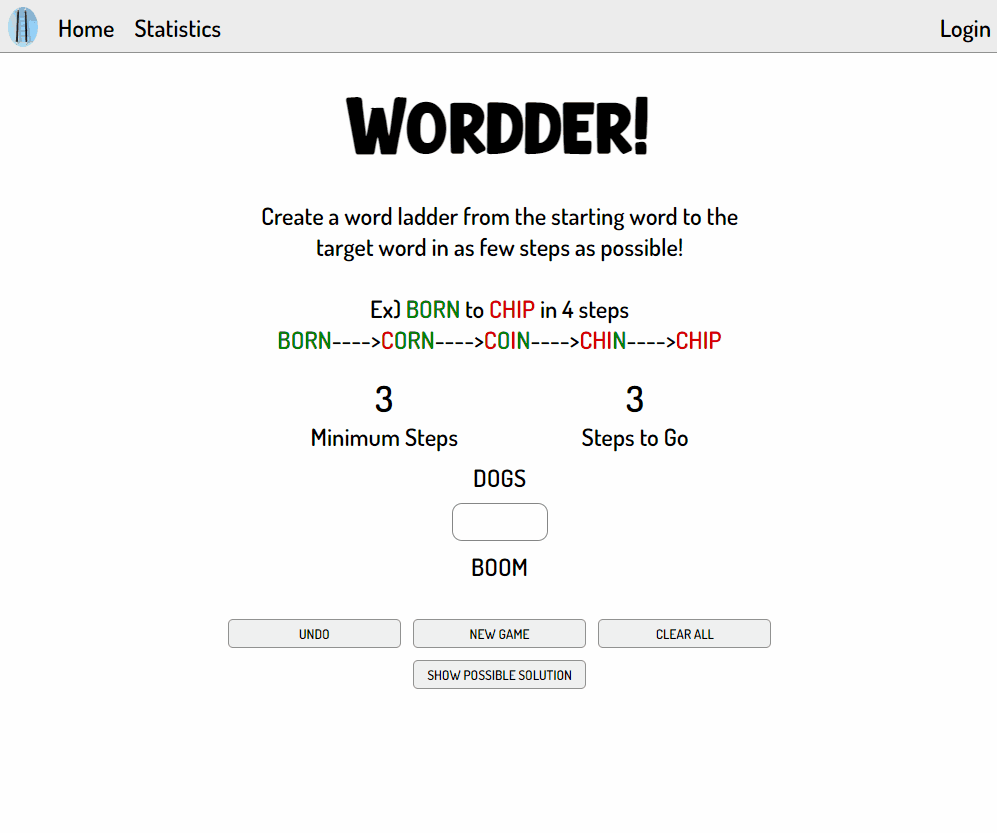

# wordder

Create a word ladder by changing 1 letter at a time and creating valid words along the way. Can you get it the minimum amount of steps? 

Features:

    -Play 2022's hottest new game! No not wordle....WORDDER!
    -Create a word ladder with a starting word traversing to a ending word in as few steps possible.
    -Hotter! or Colder! prompts will help you out along the way. 
    -Customize what words you can play with the address bar ex. https://www.playwordder.com/trap/clap
    -Word bank of over 2000 vetted words so you don't run into a nightmare scenario!
    -Hosted on my own domain https://www.playwordder.com with custom SSL certificate I painstakingly implemented instead of using Heroku's like I should have :D
    
Demonstrated Skills:

    -Uses breadth first search on a graph to traverse word lists and created shortest path
    -Uses React Redux to handle overall state of words and guesses. 
    -Uses React Router to control the links and flow of multiple webpages in the site.
    -Uses React Hooks like useState, useReducer, and useEffect to handle initialization and life cycle methods.
    -Uses the create-react-app to start the backbone of this project.
    -Uses React.js to handle all of the frontend using states, props and components with function based components.
    -Styled with classic CSS with the beautiful design of an electrical engineer with the fashion sense of a lawn mower. 

Future Ways to Improve:

    -Currently working on a login system using Oath for Facebook, Google, and custom login with backend designed in Node.js and MongoDB using mongoose. 

Overall project time: ~60 hours
Date Completed: TBA

-Gary Arzumanyan

Look how fun it is in GIF form!

